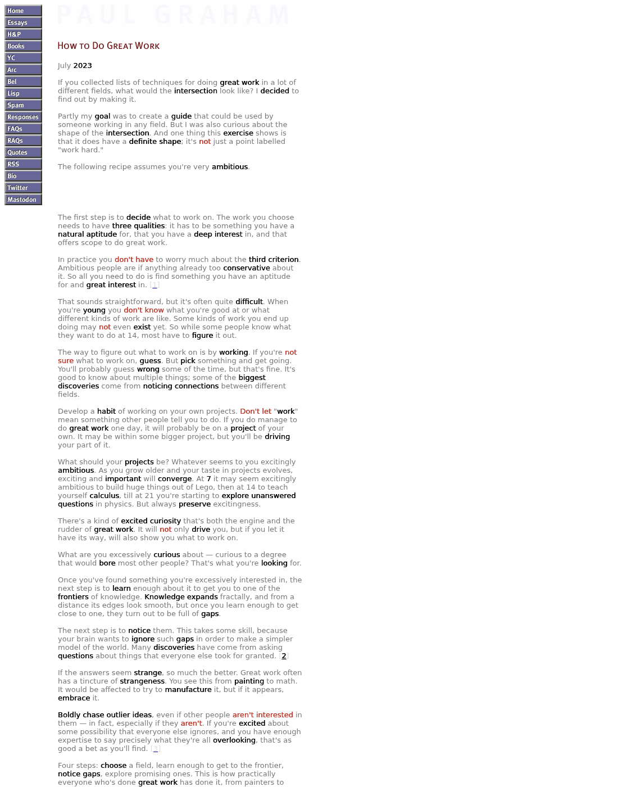

# Skimlight

[中文说明](README.zh-CN.md)

Skimlight is a Chrome extension that highlights the key words of each sentence in web articles and dims the rest of the text, so you can skim blog posts and papers faster. It works on Chinese and English pages. Press **Alt+J** to toggle it on the current page.



The word choices come from [Jev](https://typesafe.ai), TypeSafe AI's decision model, called through [OpenRouter](https://openrouter.ai). Jev does not generate text. It returns a calibrated yes/no probability for each candidate word. Skimlight is an independent project and is not affiliated with TypeSafe AI or OpenRouter.

> **Status: early prototype.** The only installer today targets Windows + WSL2 + Chrome. A native Windows installer, an options page for the API key, and macOS/Linux support are on the roadmap below.

## How it works

1. **Extract the article (in the page).** The content script locates the main content container, collects paragraph text, and keeps a per-character map back to the DOM text nodes. It skips navigation, headers, footers, code blocks and math.
2. **Process only what you read.** An `IntersectionObserver` sends only paragraphs within about 1.5 screens of the viewport. Very long blocks, such as essays that use `<br>` instead of `<p>`, are split into parts, and each part is sent when it comes into view.
3. **Generate candidates (local host).** A Python host process connected through Chrome Native Messaging splits sentences and tokenizes them: jieba for Chinese, spaCy for English. It then builds candidate units: noun phrases, content verbs and adjectives, and numbers. Negations such as `don't know` and `不生效` are always marked by rule.
4. **Score candidates with Jev.** Each candidate becomes one Noul question (`Key word in s3: "lead"?`). The judging criteria are written once in the request `state`, so each question costs about 18 input tokens. Paragraphs are batched, about 2,000 characters per request for English and 1,200 for Chinese.
5. **Render (in the page).** For each sentence, the extension keeps the top *k* candidates, where *k* ≈ 30% of the candidates (1 to 4) and *p* ≥ the threshold. It draws them with the [CSS Custom Highlight API](https://developer.mozilla.org/en-US/docs/Web/API/CSS_Custom_Highlight_API) and inserts no DOM nodes, so turning it off restores the page exactly.

Results are cached locally by paragraph hash, so reopening a page costs nothing. The host also enforces a daily spending cap.

## Cost

Jev on OpenRouter costs $0.042 per million input tokens. Output is free. Measured on test pages:

| Content | Cost |
|---|---|
| 269-word English article (whole text) | $0.00012 |
| 14,600-character Chinese article (whole text) | $0.0036 |
| Visible part of a long essay (one screen plus lookahead) | ≈ $0.0007 |

Because only the paragraphs you scroll to are sent, what you actually pay is usually below the whole-text figure.

## Requirements

- Windows 10/11 with WSL2. The current installer runs the host inside WSL.
- Chrome 111 or later
- Python 3.10+ inside WSL
- An [OpenRouter](https://openrouter.ai) API key

## Install (Windows + WSL)

Run these inside WSL:

```bash
git clone https://github.com/JackyYang258/skimlight.git
cd skimlight
python3 -m venv .venv
.venv/bin/pip install -r requirements.txt

mkdir -p ~/.config/skimlight
cat > ~/.config/skimlight/config.json <<'EOF'
{ "api_key": "sk-or-...", "daily_budget_usd": 0.5 }
EOF
chmod 600 ~/.config/skimlight/config.json

bash scripts/install_windows.sh
```

The install script copies the extension to `%LOCALAPPDATA%\Skimlight\extension`. It also registers the native messaging host under `HKCU\Software\Google\Chrome\NativeMessagingHosts\com.skimlight.host`.

Then, in Chrome:

1. Open `chrome://extensions` and turn on **Developer mode**.
2. Click **Load unpacked** and choose `%LOCALAPPDATA%\Skimlight\extension`.
3. Reload any pages that were already open.

To uninstall, run `bash scripts/uninstall_windows.sh` and remove the extension in `chrome://extensions`.

## Usage

- **Alt+J** or the toolbar button toggles the current page. You can change the shortcut at `chrome://extensions/shortcuts`.
- The popup has:
  - **Threshold** and **density** sliders. They apply instantly without new requests.
  - **Auto-enable on this site**
  - **Process the whole page at once**: off by default, so only paragraphs near the viewport are sent and more are sent as you scroll. Turn it on to annotate the entire page when you enable it, at a higher cost.
  - Failed requests are retried automatically, up to 3 times
  - Options to dim the rest of the text, add a background to key words, and mark negations
  - Cost statistics: this page, today against the daily cap (with a progress bar), last 7 and 30 days, all time, a 14-day daily chart, and the sites you spent most on in the last 30 days

## What is sent where

When Skimlight is enabled on a page, the text of the visible paragraphs is sent to the local host. From there it goes to OpenRouter, which routes it to TypeSafe's Jev. Nothing is sent while Skimlight is off. The local cache stores offsets and probabilities keyed by a hash of the text, not the text itself.

## Quality

Word choices were checked against 24 hand-labeled sentences (14 English, 10 Chinese), using precision@k: the share of chosen words that the labeler marked as key words.

| Method | English | Chinese | Input tokens per question |
|---|---|---|---|
| Skimlight (compact question format) | 94% | 90% | 18–19 |
| Verbose question with criteria in every question | 83% | 94% | 142–192 |
| TF-IDF baseline | 49% | 49% | – |

The set is small and was labeled by one person. Repeated runs vary by about 3–4 points. Treat these numbers as a sanity check, not a benchmark. The scripts are in [`research/experiments/`](research/experiments/).

## Project layout

```
extension/            Chrome extension (Manifest V3)
  content.js          article extraction, lazy processing, Custom Highlight rendering
  background.js       native messaging connection, keyboard command
  popup.html/.js      toggle, per-site auto-enable, settings, spend
host/
  skimlight_host.py   native messaging host: segmentation, Jev calls, SQLite cache, daily cap
skimlight/reader.py   segmentation and candidate generation (jieba / spaCy), Jev question format
scripts/              Windows install/uninstall, host self-test, Playwright end-to-end test
tests/pages/          local test page
research/             experiments that shaped the design (not needed at runtime)
```

## Development

```bash
.venv/bin/pip install -r requirements-dev.txt
.venv/bin/python -m playwright install chromium

.venv/bin/python scripts/host_selftest.py       # drive the host over the native messaging protocol
.venv/bin/python scripts/e2e_test.py            # load the extension in Chromium, test tests/pages/blog.html
.venv/bin/python scripts/e2e_test.py https://example.com/some-article   # or real pages
```

Both tests call Jev and need a configured API key. Host logs are in `~/.cache/skimlight/host.log`.

After changing the extension, run `bash scripts/install_windows.sh` again and click **Reload** on the extension in `chrome://extensions`.

## Known limitations

- **Article detection:** it is heuristic, so some sites include author or affiliation blocks, or miss parts of the article.
- **Chinese segmentation:** jieba can split technical terms and mixed Chinese/English identifiers incorrectly.
- **First-toggle delay:** the first toggle after starting Chrome takes 2–4 s while the host loads its models.
- **No PDF support yet:** Chrome's built-in PDF viewer cannot be modified by extensions.

## Roadmap

- Native Windows installer (PyInstaller + Inno Setup) without WSL
- Options page for the API key and provider (OpenRouter or TypeSafe directly)
- macOS and Linux host registration
- Chrome Web Store release
- PDF reading page based on pdf.js
- Unit tests with a mocked Jev and CI

## License

[MIT](LICENSE). Sample texts in `research/data/` and `tests/pages/` are adapted from Wikipedia and are licensed under [CC BY-SA 4.0](https://creativecommons.org/licenses/by-sa/4.0/). See [research/data/README.md](research/data/README.md).
